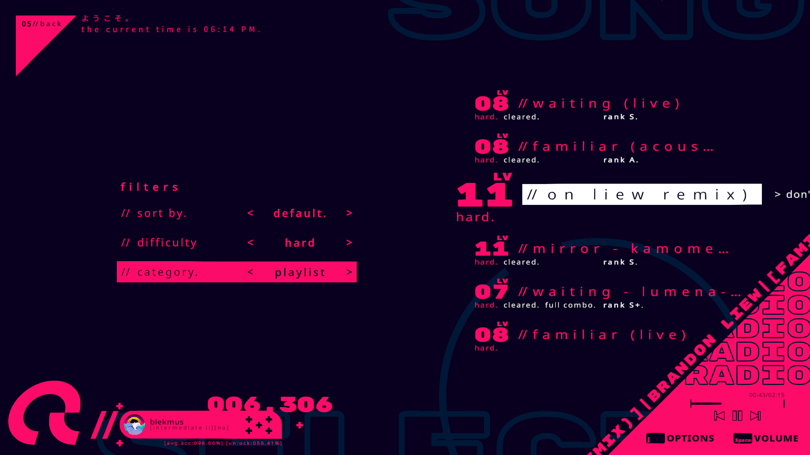
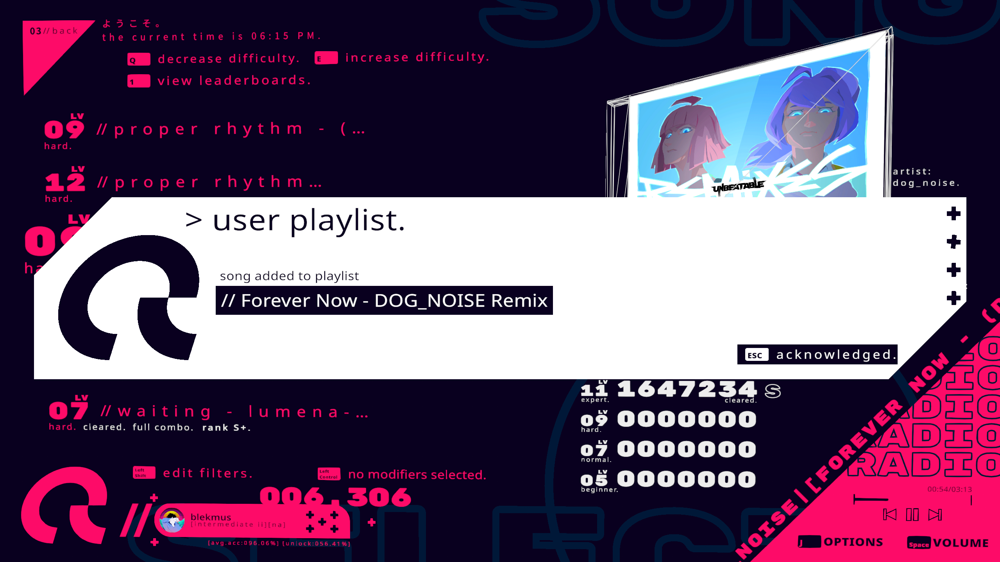
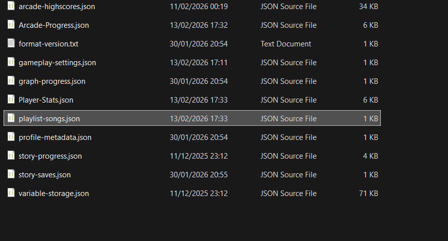

# UNBEATABLE MODS

MelonLoader mods for [UNBEATABLE](https://store.steampowered.com/app/2240620/UNBEATABLE/) by D-CELL GAMES.

## Arcade Mode Custom Playlist

As much as I love all the songs in the game, there are some that I always come back to. Considering how far my obsession for seeing only the things I want to see has gone, I made my own solution to it. I might've had to learn Unity, C#, and reverse engineering from the ground up, but it was worth it. Here's my fix for: *What if only my favorite songs were displayed?*

> Currently only tested on the windows version of the game.

Adds a new **playlist** category in the filters menu that works with all existing sorting methods.

Press `F3` to toggle songs in and out of the playlist.

The playlist is saved alongside your save files and syncs to Steam Cloud. It's stored in its own file, so if the game updates and breaks the mod, your save file won't get corrupted.

## Installation

1. Install [MelonLoader](https://github.com/LavaGang/MelonLoader.Installer) for UNBEATABLE.
2. Place the DLL in your `Mods` folder. 
3. Launch the game.

## License

MIT License - See [LICENSE](LICENSE.txt) for details

## Credits

Created by blekmus (Dinil Fernando)
